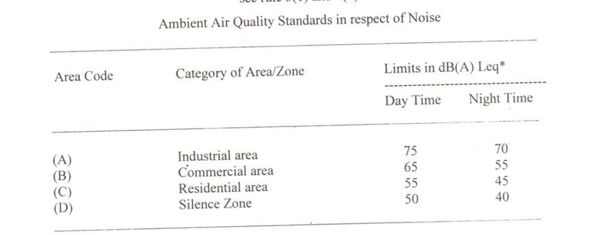
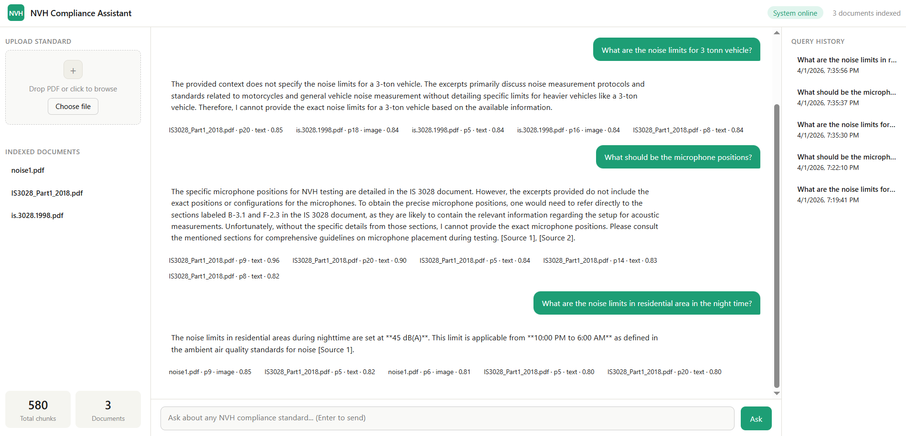

# nvh-rag-frontend
Frontend for NVH RAG
# nvh-rag-frontend
Fronend can be run by updating the URL in config.js taken from backend run.

Frontend screenshot - 

In frontend, you can add any new pdf (make sure backen is running) and answer question based on this.

Data from new file - 

Answer given by frontend (highlighted exact answer) -

